# ARC085 E - MUL

[https://atcoder.jp/contests/arc085/tasks/arc085_c](https://atcoder.jp/contests/arc085/tasks/arc085_c)

後ろから貪欲に決めていく方法ではWAです。  
たとえば以下の入力を考えたとき、貪欲だと`0`ですが、正解は`4`です。  
（こちらの反例は、[解説動画](https://www.youtube.com/watch?v=D81e49n4Byc&t=2740s)のほうで挙げられていました）

```
6
-1 -5 -5 0 5 6
```

ということで別の解法を考える必要があるのですが、事前知識がないと解くのはかなり難しいです。  
必要な事前知識というのは、最小カットに関する知識です。

## 最小カットで解ける問題は何か

最小カットとは何かを考える前に、最小カットで解ける問題は何かについて考えていきます。  
最小カットを使うことで、以下の問題を解くことができます。

* いくつかの頂点があります。頂点は、赤か青で塗られます
* ある頂点が赤、別のある頂点が青で塗られるとき、0円以上の罰金がかかります
* このような条件がいくつか与えられます
* 罰金の合計の最小値はいくらでしょうか

イメージ的には以下のような感じです。


逆にいうと、最小カットで解ける問題はこれだけです。  
しかし、頂点を追加したり条件をうまく言い換えることにより、様々な問題が解けるようになります。  
最小カットも、DPや累積和と同じように応用範囲の広いものだと言えます。

## つまり何をすればいいか

ある頂点は必ず赤か青になるという前提のもとで、以下の表を埋めることがゴールになります。


この表を埋めることができれば、あとは作業で解くことができます。  
作業のときにどういったアルゴリズムを使うかについては一旦置いておき、問題の条件を上の表に埋めていくことを考えていきます。  

## 今回の問題を言い換える

まず、宝石を割るか割らないかは、頂点を赤か青で塗ることに対応します。  
宝石はこの2つの状態以外になり得ないため、「ある頂点は必ず赤か青になる」という前提を満たします。  
よって、あとは表を埋めることだけを考えればいいことになります。  

### a_i < 0である宝石iを割らなかったとき、-a_iの罰金を支払う

この条件を表に埋めようとすると、赤の列に入れるものがないことに気付きます。


これは、表が求める条件が、2つの頂点の「関係」に罰金がかかるものだからです。  
したがって、関係を持たないような、たとえば「1つの頂点の状態だけで罰金額が決まる」という条件は、そのままだと表に当てはめることはできません。  
どうにかしてこの条件に関係を持たせる必要があります。

ここで、「必ず割る宝石S」を追加することにします。  
すると、「宝石iを割らなかったとき、-a_iの罰金を支払う」という条件は、「宝石Sを割り、宝石iを割らなかったとき、-a_iの罰金を支払う」という条件に言い換えることができます。  
これで表に埋められる形になりました。


### a_i ≧ 0である宝石iを割らなかったとき、a_iの報酬を受け取る

a_iの報酬を受け取るということは、-a_iの罰金を支払うということでもあるので、次のように埋めることを考えます。



しかし、-a_iは負であり、「0円以上の罰金」という条件を満たしません。
よって、最小カットの問題として解くことができません。  
どうにかしてこの条件を、非負の罰金がかかるような条件に言い直す必要があります。

ここで、「無条件にa_iを受け取り、宝石iを割ったときにa_iの罰金を支払う」と言い換えることを考えます。  
すると、とりあえずは非負の罰金という条件を満たすため、表に埋めることができます。


青に入れる宝石ですが、これは先程と同じように「必ず割らない宝石T」を追加することで埋めることができます。


### 宝石iを割ったとき、iの倍数が書かれている宝石を割る

iの倍数をjとします。  
今回の条件は、「宝石iを割り、宝石jを割らなかったとき、∞の罰金を支払う」と言い換えることができます。  
したがって、次のように表を埋めます。



### 宝石iを割ったとき、0円の罰金を支払う

この条件についてですが、これまで色々と条件を言い換えたことにより、少し注意して扱う必要が出てきます。  
というのも、「a_i ≧ 0である宝石iを割らなかったとき」という条件を「無条件にa_iを受け取り、宝石iを割ったとき」と言い換えたことにより、宝石を割ったときに罰金がかかるようになりました。  
したがって、「a_i ≧ 0である宝石iを割ったとき、0円の罰金を支払う」という条件はなくなります。

しかし、「a_i < 0である宝石iを割ったとき、0円の罰金を支払う」という条件はなくなっていないため、以下のように表に条件を埋めます（Tは、必ず割らない宝石です）。



## まとめ

これまでの条件を1つの表にまとめると、次のようになります。


この表さえあれば、あとはコードに書き起こすだけです。  
以下のコードはこの表から書き起こしたものですが、表の内容そのままであることがわかります。

```cpp
int main() {
  int n;
  cin >> n;
  vector<int> a(n);
  for (int i = 0; i < n; i++) {
    cin >> a[i];
  }
  int s = 0, t = n + 1;
  long long sum = 0;
  flow<long long> f(n + 2, s, t);
  for (int i = 0; i < n; i++) {
    if (a[i] < 0) {
      f.add(s, i + 1, -a[i]);
      f.add(i + 1, t, 0);
    } else {
      f.add(i + 1, t, a[i]);
      sum += a[i];
    }
  }
  for (int i = 1; i <= n; i++) {
    for (int j = i + i; j <= n; j += i) {
      f.add(i, j, numeric_limits<long long>::max());
    }
  }
  cout << sum - f.max_flow() << endl;
  return 0;
}
```

## 参考サイト

[最小カットについて](http://yosupo.hatenablog.com/entry/2015/03/31/134336)  
[最小カットを使って「燃やす埋める問題」を解く](https://www.slideshare.net/shindannin/project-selection-problem)  
[『燃やす埋める』と『ProjectSelectionProblem』](http://tokoharuland.hateblo.jp/entry/2017/11/12/234636)
