# ARC085 E - MUL

[https://atcoder.jp/contests/arc085/tasks/arc085_c](https://atcoder.jp/contests/arc085/tasks/arc085_c)

後ろから貪欲に決めていく方法ではWAです。  
たとえば以下の入力を考えたとき、貪欲だと`0`ですが、正解は`4`です。  
（こちらの反例は、[解説動画](https://www.youtube.com/watch?v=D81e49n4Byc&t=2740s)のほうで挙げられていました）

```
6
-1 -5 -5 0 5 6
```

ということで別の解法を考える必要があるのですが、事前知識がないと解くのはかなり難しいです。  
必要な事前知識というのは、最小カットに関する知識です。

## 最小カットで解ける問題は何か

最小カットとは何かを考える前に、最小カットで解ける問題は何かについて考えていきます。  
最小カットを使うことで、以下の問題を解くことができます。

* いくつかの頂点があります。頂点は、赤か青で塗られます
* ある頂点が赤、別のある頂点が青で塗られるとき、0円以上の罰金がかかります
* このような条件がいくつか与えられます
* 罰金の合計の最小値はいくらでしょうか

イメージ的には以下のような感じです。



逆にいうと、最小カットで解ける問題はこれだけです。  
しかし、頂点を追加したり条件をうまく言い換えることにより、様々な問題が解けるようになります。  
最小カットも、DPや累積和と同じように応用範囲の広いものだと言えます。

## つまり何をすればいいか

ある頂点は必ず赤か青になるという前提のもとで、以下の表を埋めることがゴールになります。


この表を埋めることができれば、あとは作業で解くことができます。  
作業のときにどういったアルゴリズムを使うかについては一旦置いておき、問題の条件を上の表に埋めていくことを考えていきます。  

## 今回の問題を言い換える

まず、宝石を割るか割らないかは、頂点を赤か青で塗ることに対応します。  
宝石はこの2つの状態以外になり得ないため、「ある頂点は必ず赤か青になる」という前提を満たします。  
よって、あとは表を埋めることだけを考えればいいことになります。  

### a_i < 0の宝石を割らなかった場合、-a_iの罰金を支払う


